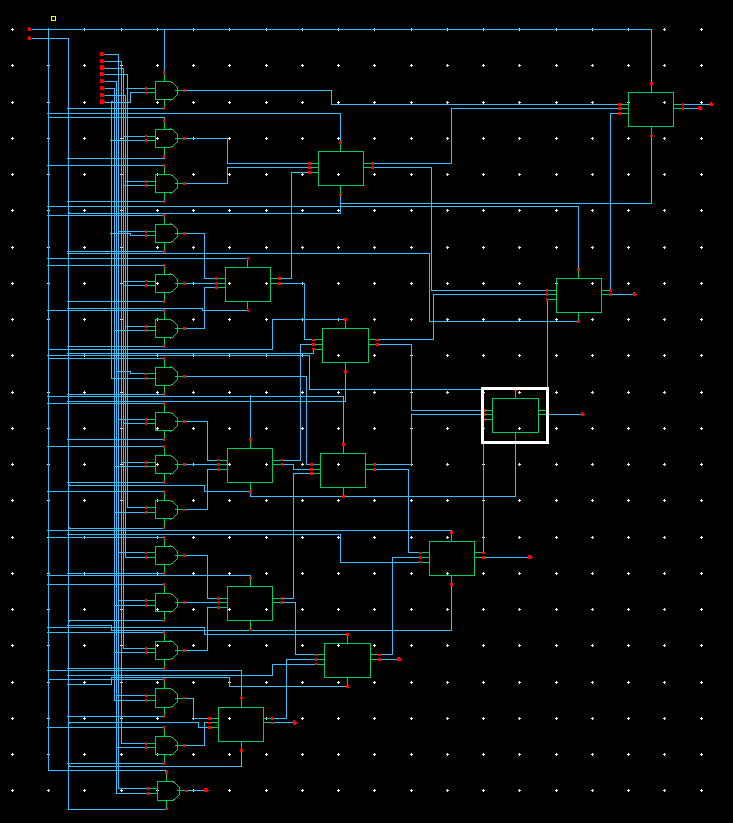
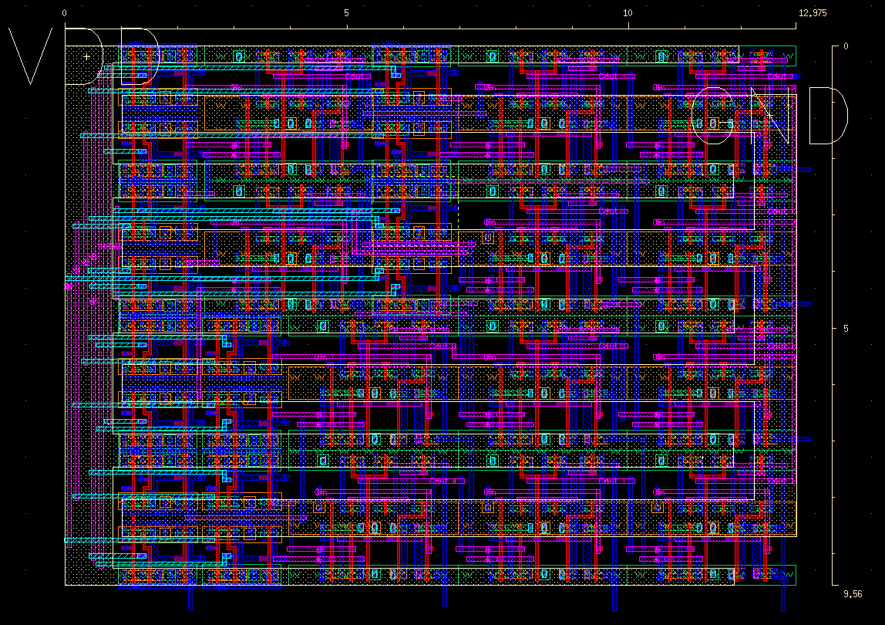

<h1 align="center"> 2020_1_VLSI </h1>

### 2020Spring_Midterm_Project [pdf](https://github.com/wjdwls0630/2020_1_VLSI/blob/master/Midterm_Project/VLSI_Midterm_Project_8%EC%A1%B0.pdf) [code](https://github.com/wjdwls0630/2020_1_VLSI/tree/master/Midterm_Project/VLSI_Midterm_Project)

### 2020Spring_Final_Project [pdf](https://github.com/wjdwls0630/2020_1_VLSI/blob/master/Final_Project/VLSI_Final_Project_8%EC%A1%B0.pdf) [code](https://github.com/wjdwls0630/2020_1_VLSI/tree/master/Final_Project/VLSI_Final_Project_Original)

#### Title: Wallace Tree Multiplier for efficient MAC

##### Design Specification

|  Spec    |   Value  |
|-----------|---|
| Worst Delay | 0.954 ns  |
| Chip size |  124.041 µm^2  |
|  Techonlogy | FreePDK 45nm (North Carolina State University)|
| VDD | 1.0V |
| Temp | 30°C |
| Rise/Fall Time | 1 ps|
